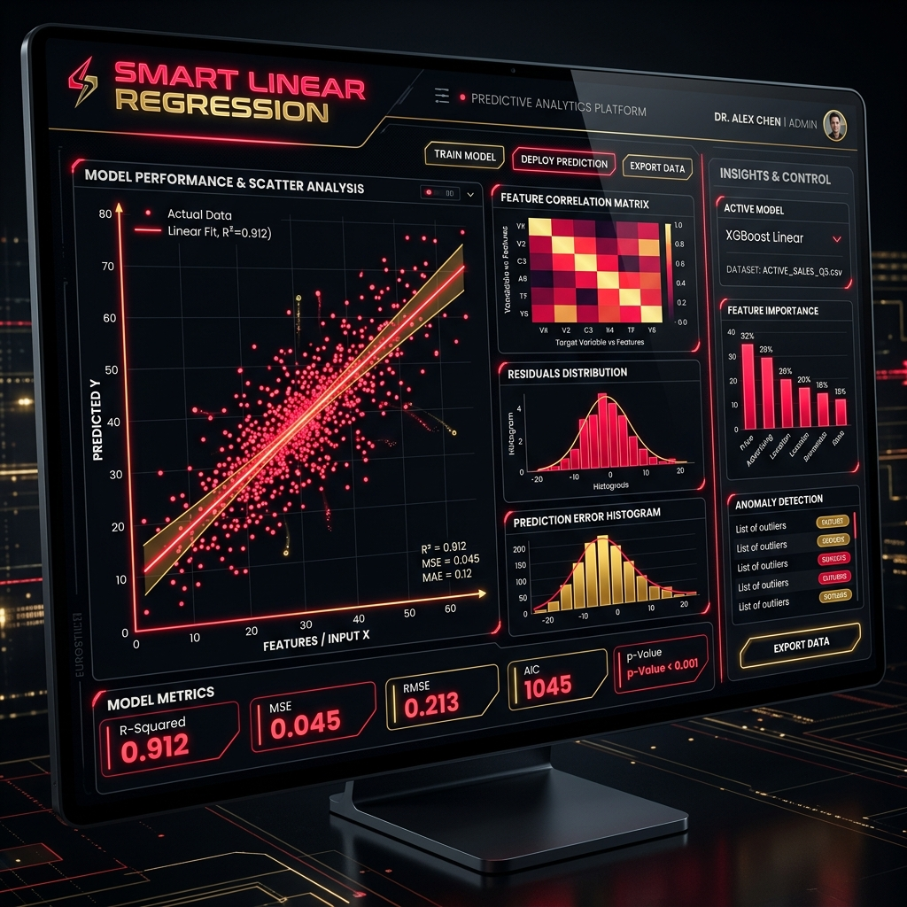

# SMART LINEAR REGRESSION 🔴💻



## ⚡ Overview
**SMART LINEAR REGRESSION** is a highly premium, state-of-the-art interactive data insight and regression modeling dashboard. Built with R Shiny, this application delivers a professional and aggressive aesthetic—combining sharp neon red accents, metallic gold typography, and a deep dark mode interface—while providing powerful statistical analysis capabilities.

Whether you're performing Simple Linear Regression or Multiple Linear Regression, this tool provides instant visualizations, dynamic modeling, and an integrated **AI Intelligent Analysis Report** that breaks down your data without jargon.

---

## 🔥 Key Features

- **Aggressive Premium UI/UX:** A bespoke dark-theme with vibrant red and gold hover effects, custom CSS scrollbars, and seamless transitions.
- **Dynamic Data Entry System:** 
  - Drag & Drop CSV files instantly into a custom-styled dropzone.
  - Manual Data Entry with dynamic multi-variable support (X1, X2, X3, etc.).
- **Instant Visualization Engine:** 
  - Generates high-quality `ggplot2` scatter plots, actual vs predicted plots, and residual diagnostics.
  - Placed seamlessly into a highly responsive grid layout.
- **AI Intelligent Analysis Report:** 
  - Automatically translates complex statistical metrics (R², P-values, SE) into human-readable insights.
  - Instant Model Health Score to quickly evaluate predictive power.
- **Lightning Fast Performance:** Clean data processing with R, designed to prevent UI lag.

---

## 🛠️ Architecture

The system is built entirely on R with a focus on custom CSS styling:
- `app.R`: Main entry point and server startup.
- `global.R`: App configuration, library loading, and reusable helper modules.
- `ui.R`: The complete frontend layout, using conditional panels and custom HTML `tags`.
- `server.R`: The backend engine powering the `lm()` models, `ggplot2` rendering, and dynamic reactive UI.
- `www/styles.css`: The heart of the "Aggressive Premium" aesthetic. Over 300 lines of custom CSS overriding native Bootstrap and Shiny styles.

---

## 🚀 How to Run

1. Clone this repository to your local machine:
   ```bash
   git clone https://github.com/abouryi12/SMART-LINEAR-REGRESSION.git
   ```
2. Open the project in **RStudio**.
3. Ensure you have the required packages installed:
   ```R
   install.packages(c("shiny", "ggplot2", "DT"))
   ```
4. Run `app.R` or click **Run App** in RStudio.

---

*Designed and engineered for precision, speed, and absolute aesthetic dominance.*
